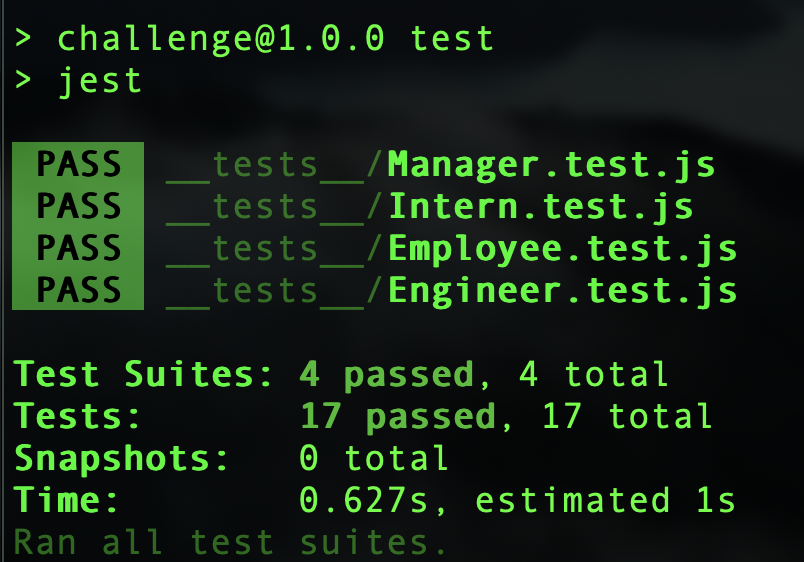
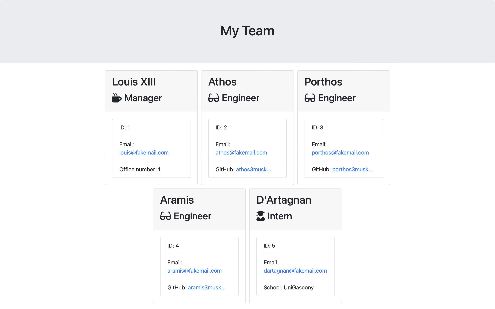

# Team Profile Generator

## Task

This week's task was to take the given starter code and convert it into a working Node.js command-line application. This application will take in information about employees on a software engineering team, then generates an HTML webpage that displays summaries for each person.

## Implementation

Firs I created Employee class which is a parent class to other three and which takes 3 properties - name, id and email. It also has 4 methods to get name, id, email and role. Following 3 classes extend this parent class and add one extra property each and one extra method to get that property. Each class also overwrites the getRole method. The starter code came with a folder to test those classes and they all passed (as they are very simple ones it would be a terrible performance on my part if they didn't).

Next I've created 3 functions in index.js. One to collect information (with inquirer) about an employee that is being added to the team, one which feeds the data from inquirer into new object which is then pushed to the list of employees and one function which gives user a chance to decide what happens after all questions about new employee are answered. If the user decides to finish building the team then render function (which was already provided with the starter code) is called and list_of_employees is passed into it. 

The very last thing was to save returned HTML into a file. Because the generated HTML wasn't responsive I've added a few lines of CSS into page-template.js into section which renders the head of the document.

A sample HTML file generated using this application can be found here:
https://michalous.github.io/team-profile-generator/

